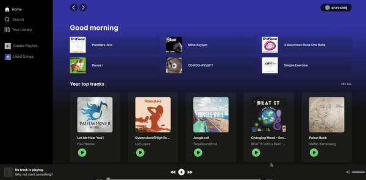

# Spotify Clone




## 📶 Live preview

[spotify-ruby-psi.vercel.app](https://spotify-ruby-psi.vercel.app/)

> [!IMPORTANT] > **This project was done as part of a 5-day machine test.**

## 🚀 Getting Started

Clone the repo

```bash
git clone https://github.com/aravsanj/Spotify.git
```

Run the development server:

```bash
npm run dev
```

Open [http://localhost:3000](http://localhost:3000) with your browser to see the result.

> [NOTE]
> You will need a [Jamendo API](https://developer.jamendo.com/v3.0/docs) client id on your local env.

## 📂 Folder structure

> [!NOTE]
> The project is following 3-layer architecture. Presentation layer, business logic layer and data access layer

```
.
└── src/
    ├── app/
    ├── components/          (Presentation layer)
    │   ├── layout/
    │   └── ui/
    ├── data/                (Data access layer)
    ├── lib/
    │   ├── types/
    │   └── utils/
    └── services/            (Business logic layer)
        ├── contexts/
        ├── hooks/
        └── providers/
```

- The `src` folder contains all the source code.
- The `app` folder contains all the pages.
- The `lib` folder contains shared types and utility functions.
- The `components` folder contains all the presentational components.
  - The `layout` folder contains all the bigger components that makes up the layout of the application. Eg: header, audio player.
  - The `ui` folder contains reusable UI components. Eg: Skeleton, Icons.
- The `data` folder contains all fetcher functions and endpoints.
- The `services` folder contains all the business logic.

## 🤷 Why 3-layer architecture?

The main intention to use 3-layer architecture is to enforce separation of concern. Here is a brief:

- The presentational components are largely only responsible for rendering the UI. They access business logic through custom hooks.

- The business logic layer contains logic for state management and data fetching. Business logic is written into / exposed through custom hooks.

- The data access layer (or api layer) contains code that actually access the data. So functions that fetch the data and api endpoints are defined here.

This creates separation between the code that

- is responsible for accessing data
- does actually fetches it and manages the state
- renders UI.

Data travels from Data access layer > business logic layer > presentation layer.

## 🎵 Jamendo API

The project is using [Jamendo API](https://developer.jamendo.com/v3.0) for its backend. It's a free api to add music to your app.

## 🧑‍💻️ Next.js proxy APIs (route handlers)

The project is using Next.js route handlers to proxy Jamendo's API. This is done to protect client secrets.

| Next route handlers               | Jamendo Api               |
| --------------------------------- | ------------------------- |
| /api/albums                       | /v3.0/albums              |
| /api/artists                      | /v3.0/tracks              |
| /api/tracks                       | /v3.0/artists             |
| /api/tracks/search?query=${query} | /v3.0/tracks?search=query |

## 🎩 SWR Library

The project is using Vercel's [SWR](https://swr.vercel.app/) library for data fetching and state management.

**Why?**

- SWR makes data fetching, caching and revalidation automatic.
- SWR supports pagination out of the box.
- SWR exposes loading / validation states, nullifying need to manually manage them.
- SWR synchronizes all the api calls to same route (key) reducing network calls.

## ⌨️ Typescript types

Since types are compile time contracts in JavaScript, they're held as close to the intended source.

Only if they're shared among different layers, they're stored in `lib` folder.

## 🤧 known issues

- Background gradient breaking on tracks page after infinite scroll.
- Search page holds result of the last search (deliberately kept).
- Some styling issues for responsive designs.

## 🤝 Contribution

> [Note]
> This project was done as part of a 5-day machine test. But it will be improved up on.

## 📃 License

This project is licensed under AGPLv3, see [LICENSE](https://github.com/aravsanj/Spotify/blob/main/LICENSE).
